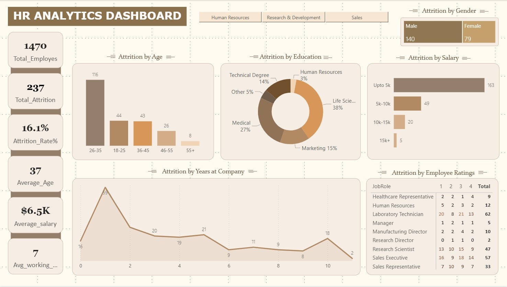

# 📊 HR Attrition Analytics Dashboard

This project is an **interactive HR Analytics Dashboard** built using Power BI to analyze employee attrition and workforce insights.

Starting from raw HR data, I performed data cleaning, transformation, and created interactive visualizations to uncover key patterns in employee behavior.

---

## 🔍 Key Insights

- Total Employees: **1470**
- Attrition Rate: **16.1%**
- Highest attrition in age group **26–35**
- Lower salary employees have higher attrition
- Sales & Research departments show high turnover

---

## 🛠️ Tools Used

- Power BI  
- DAX  
- Data Modeling  
- Data Cleaning  

---

## 📈 Dashboard Features

- Attrition by Age, Salary, Education  
- Department-wise filtering  
- Employee performance insights  
- Interactive visuals  

---

## 📸 Dashboard Preview

---

## 📁 Project Files

- `Hr Analytics Dashboard.pbix`
- `HR_Analytics.csv`

---

## 🎯 Objective

To analyze employee attrition and provide insights for better HR decision-making.

---

## 🙌 Feedback

If you have any suggestions or feedback, feel free to connect!
